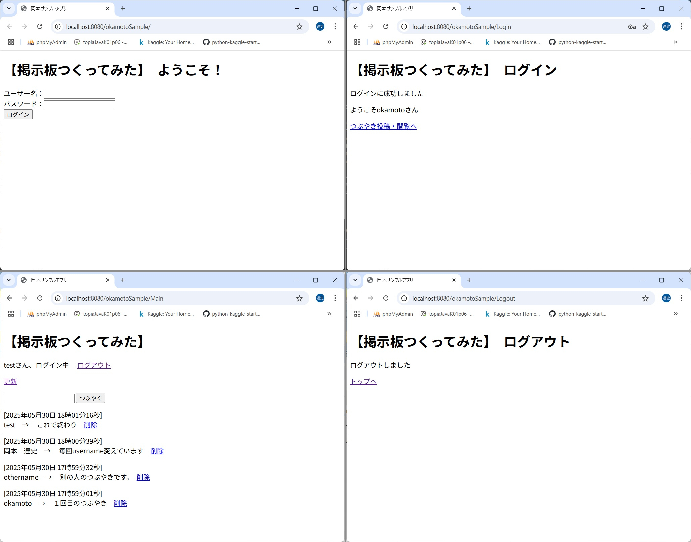

## 岡本達史（おかもとさとし）の公開フォルダです。
私のスキルの参考としてこのフォルダを作っております。
すべて自作のコードですので、ご自由にご利用ください。

# ファイル一覧
詳細は下記各ファイルの段落をご覧ください。
- Kaggleデータ分析処理のコード（Notebook）  
　　"titanic-a-set-of-fundamental-analyses.ipynb" [詳細](titanic-a-set-of-fundamental-analyses.ipynb)  
　　　　
- Kaggleデータ分析処理のコード（Python）  
　　"titanic_code_only.py" [詳細](titanic_code_only.py)
- LINE・スプレッドシート連携アプリのコード（JavaScript, GAS）  
　　"LINEから見積書.txt" [詳細](LINEから見積書.txt)  
- ExcelVBAビッグデータ処理コード  
　　"vba_code_only.txt"[詳細](vba_code_only.txt)
- OutlookVBAメール自動返信のコード  
　　"問い合わせメール自動返信vba.txt"[詳細](問い合わせメール自動返信vba.txt) 
- Java掲示板アプリのコード（Java）  
　　"掲示板アプリプロジェクト"[詳細](掲示板アプリプロジェクト)
  
# Kaggleデータ分析処理のコード（Python3）
国際的なデータ分析コンペティションのプラットフォームであるKaggleの入門コンペ【Titanic - Machine Learning from Disaster】での分析です。   
簡単にではありますが、データ分析と機械学習・ディープラーニングの処理をNotebookに記してあります。    
NotebookではなくPython3のコードのみのファイルも公開しております。  
| 内容 | ファイル名 | Colab | Kaggle |
| :-- | :-- | :-- | :-- | 
| Kaggleデータ分析Notebook | [詳細](titanic-a-set-of-fundamental-analyses.ipynb) |  |  |
| Kaggleデータ分析PythonCode | [詳細](titanic_code_only.py) | | |
  
# LINE・スプレッドシート連携アプリのコード（JavaScript, GAS）
前職で作ったLINE・スプレッドシート連携アプリのコードです。  
[詳細](LINEから見積書.txt)
LINEでの入力により現場画像付きの見積書をすばやく作成し、PDFファイルとして取引先に送付することができます。  
アプリのために作成した業務用LINEアカウント（公式アカウントと呼ばれています）とユーザーが友達になり、対話形式で求められる情報を入力していきます。  
以下がスマートフォンでの情報入力デモ画面です。  
  
以下が作成される見積書の見本です。画像は適当に当てはめただけのもので、本来現場の写真が入ります。  
  

# ExcelVBAビッグデータ処理コード（VBA）  
前職のコールセンターでは１ケ月で10万件の問い合わせを処理していました。その応答状況を専用ソフトウェアのエクスポートファイルから集計し、ダッシュボードに表示するアプリの一部分です。  
[詳細](vba_code_only.txt)  
機密性の高い情報ですので、一部のコードのみの公開とさせていただきます。  
興味がおありでしたら、お会いしたときに詳細をお話しさせてください。  
  
# OutlookVBAメール自動返信のコード（VBA）  
前職の不動産賃貸部門で使っていた、Outlookに設定する問い合わせメールへの自動返信のVBAコードです。  
[詳細](問い合わせメール自動返信vba.txt)  
大手の不動産賃貸サイトSUUMOで自社の管理する物件に問い合わせのクリックが発生すると、問い合わせの詳細メールが届きます。  
そのメールの内容を読み取り、瞬時に問い合わせ相手のお客様に問い合わせ結果のメールを送信します。  
お客様は数社・数物件に同時に問い合わせを入れることが多く、秒を争う返信合戦になりますが、そのための自動返信コードです。  
  
# Java掲示板アプリのコード（Java）  
Javaの現時点での知識のまとめとして、サーブレットによる掲示板アプリを作成しました。
Tomcatのサーバーにメッセージの情報を入れ、ログイン、メッセージを表示・削除などの機能を付けました。
Eclipseでのフォルダ構成に合わせています。
[詳細](掲示板アプリプロジェクト)
デモ画面を以下に示します。

Javaはまだ学び始めて４ヶ月です。簡単なアプリですが、現状の実力だと思います。
